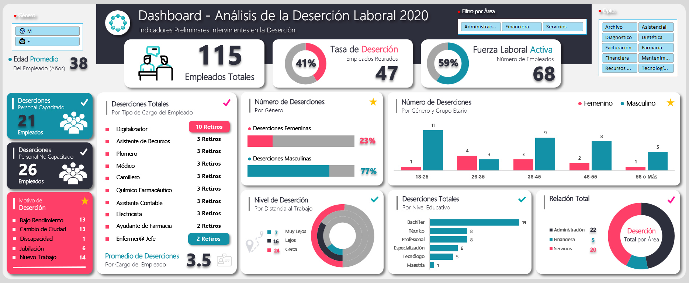

# Mayo Hospital Job Dropout Dashboard 2020

Welcome to the Mayo Hospital Job Dropout Data Analysis Project! This project focuses on analyzing job dropout data using Microsoft Excel.

## Project Objective

The hospital wants to create a job dropout dashboard to identify the underlying causes of employee turnover, analyze trends and patterns in job desertions, and develop targeted strategies to enhance employee retention.

## Project Overview

### Data

You can see the dataset here [Job Dropout Dataset](./dataset.csv)

### SQL Analysis

Explore the following resources:

- [SQL Analysis Script:](./analysis.sql) The SQL script used for data analysis.
- [Query Results:](./analysis.docx) A document containing the results of the executed queries.
- [Database Backup (.bacpac):](./mayoHospital.bacpac) A backup file of the database, including its schema and data.

### Project

You can see the final project here [Project](./dashboard.xlsx)

### Conclusions

- 41% of employees have resigned
- Most of the employees who resigned are untrained (26)
- Poor performance and change of city are the most common reasons of resigning (13)
- Most of the employees who resigned are between 18 and 25 years old
- 77% of the employees who resigned are male
- Most of the employees who resigned have a bachelor's degree (19)
- Administration is the area with the highest number of employee resignations (22)
- 51% of the employees who resigned live close to work
